# 📋 MEMORIA TÉCNICA COMPLETA — SISTEMA GMAO
## Sistema de Gestión de Mantenimiento Asistido por Ordenador

**Fecha de generación:** 10 de septiembre de 2026  
**Propósito:** Documentación exhaustiva para reconstruir el sistema desde cero.

---

## 1. DESCRIPCIÓN GENERAL DEL SISTEMA

### 1.1 ¿Qué es?
Es un **sistema GMAO (Gestión de Mantenimiento Asistido por Ordenador)** completo, diseñado para una **fábrica de cerámica**. Gestiona todo el ciclo de vida del mantenimiento industrial: desde las máquinas y sus repuestos, hasta las órdenes de trabajo, turnos del personal, inventario, proveedores, documentación técnica y predicciones de fallos con IA.

### 1.2 Funcionalidades Principales

| Módulo | Descripción |
|--------|-------------|
| **Dashboard** | Panel principal con KPIs, gráficos y resumen de actividad |
| **Info Planta** | Visualización de la estructura de planta (Secciones → Líneas → Máquinas) |
| **Mantenimiento Preventivo** | Programación y seguimiento de mantenimientos periódicos |
| **Mantenimiento Legal** | Control de revisiones obligatorias legales (certificados, normativas) |
| **Plan Anual** | Vista anual del plan de mantenimiento |
| **Órdenes de Trabajo** | Creación, asignación y seguimiento de OTs (correctivas, preventivas, cambios de formato) |
| **Partes de Trabajo** | Registro de intervenciones con tiempos, materiales y costes |
| **Máquinas** | Catálogo de máquinas con ficha técnica, BOM, historial y QR |
| **Inventario y Almacenes** | Gestión de repuestos con stock mínimo, ubicación por almacén |
| **Proveedores** | Base de datos de proveedores y comparador de precios |
| **Usuarios y Roles** | Sistema de permisos con roles jerárquicos |
| **Turnos y Vacaciones** | Patrones rotativos de turno, calendario, ausencias y vacaciones |
| **Comunicaciones** | Sistema interno de comunicación bidireccional (operarios ↔ administración) |
| **Documentos** | Gestión documental con adjuntos y procesamiento con IA |
| **Auditoría (Audit Trail)** | Registro completo de acciones con trazabilidad |
| **Gamificación** | Sistema de puntos, logros, retos y rankings para motivación del personal |
| **IA Predictiva** | Predicción de fallos, chat con IA (Ollama), dashboard de predicciones |
| **Scheduler** | Automatización de tareas programadas (generación de OTs, alertas, stock) |
| **Códigos de Diagnóstico** | Gestión de códigos de fallo, causa y remedio normalizados |
| **Listas de Tareas** | Checklists con pasos y tiempos estimados para procedimientos |
| **Backlog** | Cola de tareas pendientes de mantenimiento con priorización |
| **Cambios de Formato** | Control de cambios de formato de producción con tiempos y equipos |
| **Alertas/Notificaciones** | Sistema centralizado de alertas y notificaciones |
| **QR** | Generación y escaneo de códigos QR para identificación rápida de máquinas |

---

## 2. ARQUITECTURA TÉCNICA

### 2.1 Stack Tecnológico

```
┌──────────────────────────────────────────────────┐
│                   NGINX (Puerto 80/443)           │
│           Reverse Proxy + Servir React            │
│   SSL: Certificado auto-firmado                   │
├──────────────────────────────────────────────────┤
│                                                    │
│  ┌───────────────────┐  ┌──────────────────────┐  │
│  │   FRONTEND        │  │   BACKEND            │  │
│  │   React 18        │  │   FastAPI (Python)    │  │
│  │   Ant Design 5    │  │   Puerto 8000         │  │
│  │   Puerto 80       │  │   Uvicorn ASGI        │  │
│  └───────────────────┘  └──────────────────────┘  │
│                                                    │
│           ┌──────────────────────────┐             │
│           │   BASE DE DATOS          │             │
│           │   PostgreSQL 17.2        │             │
│           │   Puerto 5432            │             │
│           └──────────────────────────┘             │
│                                                    │
│           ┌──────────────────────────┐             │
│           │   IA (OLLAMA)            │             │
│           │   Puerto 11434           │             │
│           │   Host: 192.168.1.62     │             │
│           └──────────────────────────┘             │
└──────────────────────────────────────────────────┘
```

### 2.2 Infraestructura

| Componente | Tecnología | Versión/Detalle |
|------------|-----------|-----------------|
| **Frontend** | React + Ant Design + MUI | React 18.2, Ant Design 5.11, MUI 6.3 |
| **Backend** | FastAPI + SQLAlchemy | FastAPI 0.95.1, SQLAlchemy 1.4.46 |
| **Base de Datos** | PostgreSQL | 17.2 |
| **Servidor Web** | Nginx | Reverse proxy con SSL |
| **IA** | Ollama (LLM local) | Servidor externo en 192.168.1.62:11434 |
| **Contenedores** | Docker + Docker Compose | 3 servicios: db, backend, nginx |
| **Scheduler** | APScheduler | 3.10.1 (BackgroundScheduler) |
| **Autenticación** | JWT (Bearer Token) | python-jose + passlib/bcrypt |
| **Migraciones** | Alembic | 1.13.1 |
| **Servidor** | Ubuntu | IP: 192.168.1.15, SSH puerto 22 |
| **Dominio** | No-IP (DDNS) | fromeram.no-ip.org |

### 2.3 Despliegue con Docker Compose

**3 servicios:**
1. **db** → PostgreSQL 17.2 con volumen persistente `gmao-db-data`
2. **backend** → FastAPI con Uvicorn, depende de `db` (healthcheck)
3. **nginx** → Construido desde `frontend/Dockerfile`, sirve React build + proxy a backend

**Red:** `gmao-network` (red default de Docker)

### 2.4 Configuración de Nginx

- Puerto 80 → Redirección 301 a HTTPS
- Puerto 443 → SSL con certificado auto-firmado
- `/` → Sirve archivos estáticos de React (`/usr/share/nginx/html`)
- `/api/` → Proxy a `http://backend:8000/` (elimina el prefijo `/api/`)
- `/token` → Proxy directo a `http://backend:8000/token`
- `/documents/` → Proxy a backend para subida de documentos
- `/protected_files/` → Alias interno para descargas de ficheros adjuntos
- `client_max_body_size` → 100MB
- Timeouts → 600s (para peticiones de IA)

---

## 3. BACKEND — ESTRUCTURA DETALLADA

### 3.1 Estructura de Directorios

```
backend/
├── src/
│   ├── main.py                    # Punto de entrada FastAPI
│   ├── config.py                  # Variables de configuración
│   ├── database.py                # Conexión SQLAlchemy
│   ├── auth.py                    # Autenticación JWT + bcrypt
│   ├── dependencies.py            # Dependencias compartidas
│   ├── routes.py                  # Router principal (~500KB, monolítico)
│   ├── routes_ai.py               # Rutas de IA (chat, modelos, config)
│   ├── routes_ai_dashboard.py     # Dashboard de IA
│   ├── routes_gamification.py     # Sistema de gamificación
│   ├── routes_legal.py            # Mantenimiento legal
│   ├── routes_machines.py         # Rutas específicas de máquinas
│   ├── routes_notifications.py    # Alertas y notificaciones
│   ├── routes_plan_anual.py       # Plan anual de mantenimiento
│   ├── routes_scheduler.py        # Admin del scheduler
│   ├── routes_work_orders.py      # Órdenes de trabajo
│   ├── scheduler.py               # Tareas programadas (APScheduler)
│   ├── models/                    # Modelos SQLAlchemy (41 archivos)
│   ├── schemas/                   # Esquemas Pydantic (11 archivos)
│   ├── routers/
│   │   └── communication_routes.py # Comunicaciones internas
│   ├── ai/                        # Módulo de IA
│   │   ├── ollama_client.py       # Cliente para Ollama API
│   │   ├── predictive_service.py  # Servicio de predicciones
│   │   ├── prediction_scheduler.py # Scheduler de predicciones
│   │   ├── document_processor.py  # Procesamiento de documentos con IA
│   │   └── memory_service.py      # Servicio de memoria para IA
│   ├── gamification/              # Lógica de gamificación
│   ├── utils/                     # Utilidades
│   ├── middleware/                 # Middlewares
│   └── storage/                   # Almacenamiento de ficheros
├── requirements.txt               # Dependencias Python
└── Dockerfile                     # Imagen Docker del backend
```

### 3.2 Dependencias Python (requirements.txt)

```
fastapi==0.95.1
uvicorn==0.22.0
SQLAlchemy==1.4.46
psycopg2-binary==2.9.6
python-jose==3.3.0
passlib==1.7.4
bcrypt==4.0.1
python-dotenv==1.0.0
alembic==1.13.1
APScheduler==3.10.1
python-dateutil==2.8.2
aiohttp==3.9.3
aiofiles==23.2.1
Pillow==10.2.0
python-multipart==0.0.7
pydantic>=1.10.0,<2.0.0
werkzeug==2.3.7
pytz==2023.3.post1
numpy
```

### 3.3 Configuración (Variables de Entorno)

| Variable | Descripción | Valor Ejemplo |
|----------|-------------|---------------|
| `POSTGRES_USER` | Usuario PostgreSQL | `Admin` |
| `POSTGRES_PASSWORD` | Contraseña PostgreSQL | (definir) |
| `POSTGRES_DB` | Nombre de la BD | `gmao_db` |
| `DATABASE_URL` | URL de conexión SQLAlchemy | `postgresql+psycopg2://user:pass@db/gmao_db` |
| `JWT_SECRET_KEY` | Clave secreta para JWT | (definir - segura) |
| `JWT_ACCESS_TOKEN_EXPIRE_MINUTES` | Duración del token (min) | `60` |
| `INITIAL_ADMIN_USERNAME` | Usuario admin inicial | `Admin` |
| `INITIAL_ADMIN_PASSWORD` | Contraseña admin inicial | (definir) |
| `OLLAMA_URL` | URL del servidor Ollama | `http://192.168.1.62:11434` |
| `REACT_APP_API_URL` | URL base de la API para el frontend | `/api` |

### 3.4 Autenticación y Autorización

- **Método:** JWT Bearer Token
- **Hashing:** bcrypt (passlib)
- **Token endpoint:** `POST /token` (recibe JSON `{username, password}`)
- **Almacenamiento token (frontend):** `sessionStorage`
- **Expiración:** 60 minutos (configurable)
- **Jerarquía de roles (3 niveles):**
  1. `get_current_user` → Cualquier usuario autenticado
  2. `get_jefe_seccion_user` → Administrador, Jefe de Mantenimiento, Jefe de Sección
  3. `get_admin_user` → Administrador, Jefe de Mantenimiento

### 3.5 Scheduler (Tareas Programadas)

El sistema usa **APScheduler (BackgroundScheduler)** con las siguientes tareas:

| Tarea | Cron | Descripción |
|-------|------|-------------|
| `generate_orders` | `0 0 * * *` (00:00) | Genera OTs automáticas desde mantenimientos preventivos |
| `check_upcoming` | `0 8 * * *` (08:00) | Alertas de mantenimientos próximos (7 días) |
| `check_stock` | `0 9 * * *` (09:00) | Verificación de stock mínimo |
| `check_overdue` | `0 10 * * *` (10:00) | Detección de mantenimientos vencidos |
| `auto_ai_predictions` | Configurable | Ciclo de predicciones IA (cada 30 min por defecto) |

### 3.6 Módulo de IA

- **Ollama Client:** Conexión a servidor Ollama externo para LLM local
- **Servicios:**
  - Chat conversacional con contexto de la planta
  - Predicción de fallos por máquina
  - Procesamiento de documentos (facturas, albaranes)
  - Optimización de programación de mantenimiento
  - Dashboard de rendimiento de modelos IA

---

## 4. FRONTEND — ESTRUCTURA DETALLADA

### 4.1 Estructura de Directorios

```
frontend/
├── src/
│   ├── App.js                     # Router principal con todas las rutas
│   ├── index.js                   # Punto de entrada React
│   ├── apiConfig.js               # Configuración API + fetchWithAuth + axios
│   ├── config.js                  # Configuración general
│   ├── contexts/
│   │   └── AuthContext.js         # Contexto de autenticación React
│   ├── components/                # 30 componentes reutilizables
│   │   ├── MainLayout.js          # Layout principal con sidebar
│   │   ├── Sidebar.js             # Menú lateral de navegación
│   │   ├── ProtectedRoute.js      # Protección de rutas privadas
│   │   ├── NotificationCenter.js  # Centro de notificaciones
│   │   ├── AlertsSidebar.js       # Sidebar de alertas
│   │   ├── DocumentAttachmentManager.js  # Gestor de adjuntos
│   │   ├── FormatChangeForm.js    # Formulario cambio de formato
│   │   ├── TechnicianManager.js   # Gestión de técnicos en OT
│   │   ├── GamificationNotifications.js  # Notificaciones gamificación
│   │   └── ... (20 más)
│   ├── pages/                     # 54 páginas/vistas
│   │   ├── Dashboard.js           # Panel principal
│   │   ├── Login.js               # Inicio de sesión
│   │   ├── Maquinas.js            # Listado de máquinas
│   │   ├── MachineDetailFixed.js  # Detalle máquina (ficha+BOM+historial)
│   │   ├── Ordenes.js             # Listado de órdenes de trabajo
│   │   ├── WorkOrderForm.js       # Formulario creación/edición OT
│   │   ├── Inventario.js          # Gestión de inventario
│   │   ├── Usuarios.js            # Gestión de usuarios
│   │   ├── CalendarioTurnos.js    # Calendario de turnos
│   │   ├── CalendarioVacaciones.js # Calendario de vacaciones
│   │   ├── MantenimientoLegal.js  # Mantenimiento legal
│   │   ├── Communications.js      # Comunicaciones internas
│   │   ├── AIChat.js              # Chat con IA
│   │   ├── AIPredictions.js       # Predicciones IA
│   │   ├── Gamification.js        # Ranking y logros
│   │   └── ... (39 más)
│   ├── styles/                    # Archivos CSS
│   └── utils/                     # Utilidades JS
├── package.json
└── Dockerfile                     # Build React + Nginx
```

### 4.2 Dependencias Frontend (package.json)

```json
{
  "@ant-design/icons": "^5.2.6",
  "@emotion/react": "^11.14.0",
  "@emotion/styled": "^11.14.0",
  "@mui/material": "^6.3.1",
  "antd": "^5.11.0",
  "axios": "^1.7.2",
  "chart.js": "^4.1.1",
  "dayjs": "^1.11.13",
  "jspdf": "^3.0.1",
  "jspdf-autotable": "^5.0.2",
  "jwt-decode": "^4.0.0",
  "lucide-react": "^0.474.0",
  "moment": "^2.30.1",
  "qrcode.react": "^3.1.0",
  "react": "^18.2.0",
  "react-calendar": "^5.1.0",
  "react-chartjs-2": "^5.3.0",
  "react-dom": "^18.2.0",
  "react-hook-form": "^7.54.2",
  "react-modal": "^3.16.3",
  "react-router-dom": "^6.14.1",
  "react-scripts": "5.0.1",
  "react-select": "^5.10.0",
  "xlsx": "^0.18.5"
}
```

### 4.3 Rutas del Frontend (App.js)

| Ruta | Componente | Descripción |
|------|-----------|-------------|
| `/login` | Login | Inicio de sesión |
| `/` | Dashboard | Panel principal |
| `/info-planta` | InfoPlanta | Estructura de la planta |
| `/mantenimiento` | Mantenimiento | Panel de mantenimiento |
| `/mantenimiento/preventivo` | MantenimientoPreventivo | Preventivos |
| `/mantenimiento/legal` | MantenimientoLegal | Mantenimiento legal |
| `/plan-anual` | PlanAnualMantenimiento | Plan anual |
| `/maquinas` | Maquinas | Listado de máquinas |
| `/maquinas/:id/detail` | MachineDetailFixed | Detalle de máquina |
| `/maquinas/:id/bom` | MachineDetailFixed | BOM de máquina |
| `/maquinas/:id/history` | MachineDetailFixed | Historial de máquina |
| `/maquinas/qr` | QRGenerator | Generador de QR |
| `/maquinas/scan` | QRScanner | Escáner de QR |
| `/listas-tareas` | TaskListManagement | Gestión de listas de tareas |
| `/listas-tareas/:id/pasos` | TaskStepManagement | Pasos de lista de tareas |
| `/gestion-codigos` | GestionCodigos | Gestión de códigos fallo/causa/remedio |
| `/ordenes` | Ordenes | Órdenes de trabajo |
| `/partes` | Partes | Partes de trabajo |
| `/proveedores` | Suppliers | Proveedores |
| `/secciones` | Secciones | Gestión de secciones |
| `/almacenes` | Almacenes | Gestión de almacenes |
| `/inventario` | Inventario | Inventario de repuestos |
| `/inventario/bajo-stock` | LowStockInventory | Productos bajo stock |
| `/usuarios` | Usuarios | Gestión de usuarios |
| `/gestion-patrones` | ShiftPatternManagement | Patrones de turno |
| `/calendario-turnos` | CalendarioTurnos | Calendario de turnos |
| `/calendario-vacaciones` | CalendarioVacaciones | Calendario vacaciones |
| `/productos` | Productos | Listado de productos |
| `/productos/:id` | ProductoDetalle | Detalle de producto |
| `/documentos` | DocumentManager | Gestión de documentos |
| `/documentos/:id/verificar` | DocumentVerification | Verificación de documento |
| `/reporte-inventario` | InventoryReport | Informe de inventario |
| `/backlog-mantenimiento` | MaintenanceBacklog | Backlog de mantenimiento |
| `/scheduler-admin` | SchedulerAdmin | Admin del scheduler |
| `/comparar-precios` | PriceComparator | Comparador de precios |
| `/gamification` | Gamification | Ranking y logros |
| `/gamification-admin` | GamificationSetup | Admin gamificación |
| `/formatos` | FormatManager | Gestión de formatos |
| `/cambios-formato` | FormatChangesList | Historial cambios formato |
| `/reportes-formato` | FormatReports | Informes de formato |
| `/ai-dashboard` | AIDashboard | Dashboard de IA |
| `/ai-chat` | AIChat | Chat con IA |
| `/ai-predictions` | AIPredictions | Predicciones de IA |
| `/ai-admin` | AIAdmin | Admin de IA |
| `/communications` | Communications | Comunicaciones |
| `/communication-admin` | CommunicationAdmin | Admin comunicaciones |
| `/audit-trail` | AuditTrail | Registro de auditoría |

### 4.4 Comunicación Frontend ↔ Backend

- **Método 1 (legacy):** `fetchWithAuth()` — wrapper de `fetch()` nativo con token JWT automático
- **Método 2 (nuevo/IA):** `axios` instance (`api`) con interceptores para token JWT
- **Base URL:** `/api` (Nginx hace reverse proxy eliminando el prefijo)
- **Token:** Almacenado en `sessionStorage.getItem('access_token')`

---

## 5. BASE DE DATOS — ESQUEMA COMPLETO

### 5.1 Motor y Conexión

- **Motor:** PostgreSQL 17.2
- **ORM:** SQLAlchemy 1.4.46
- **Migraciones:** Alembic 1.13.1
- **Pool:** `pool_size=30, max_overflow=60`
- **Volumen Docker:** `gmao-db-data` (persistente)

### 5.2 Tipos ENUM Personalizados

```sql
CREATE TYPE achievementtype AS ENUM ('SPEED', 'QUALITY', 'CONSISTENCY', 'LEARNING', 'TEAMWORK', 'INNOVATION');
CREATE TYPE badgerarity AS ENUM ('COMMON', 'RARE', 'EPIC', 'LEGENDARY');
CREATE TYPE communication_status AS ENUM ('Pendiente', 'Revisado', 'En Proceso', 'Resuelto', 'Rechazado');
CREATE TYPE communication_type AS ENUM ('Sugerencia', 'Pedido de Material', 'Queja/Problema', 'Consulta', 'Otro', 'Mensaje Administrativo', 'Asignación de Tarea', 'Comunicado');
CREATE TYPE vacation_status_enum AS ENUM ('Solicitado', 'Aprobado', 'Rechazado');
```

### 5.3 Tablas — Definición Completa (48 tablas)

> **Nota:** Las tablas `alembic_version` y `backup_alembic_version` son de control de migraciones y no necesitan recrearse manualmente.

---

#### `roles`
| Columna | Tipo | Restricciones |
|---------|------|---------------|
| id | SERIAL | PK |
| nombre | VARCHAR(50) | NOT NULL, UNIQUE |

---

#### `sections`
| Columna | Tipo | Restricciones |
|---------|------|---------------|
| id | SERIAL | PK |
| nombre | VARCHAR(255) | NOT NULL, UNIQUE |

---

#### `lines`
| Columna | Tipo | Restricciones |
|---------|------|---------------|
| id | SERIAL | PK |
| nombre | VARCHAR(255) | NOT NULL |
| section_id | INTEGER | NOT NULL, FK → sections.id |

---

#### `machines`
| Columna | Tipo | Restricciones |
|---------|------|---------------|
| id | SERIAL | PK |
| nombre | VARCHAR(255) | NOT NULL |
| modelo | VARCHAR(255) | NOT NULL |
| marca | VARCHAR(255) | NOT NULL |
| numero_serie | VARCHAR(255) | NOT NULL, UNIQUE |
| section_id | INTEGER | NOT NULL, FK → sections.id |
| line_id | INTEGER | NOT NULL, FK → lines.id |
| criticidad | VARCHAR(50) | NULL |

---

#### `users`
| Columna | Tipo | Restricciones |
|---------|------|---------------|
| id | SERIAL | PK |
| username | VARCHAR | NOT NULL, UNIQUE |
| password | VARCHAR | NOT NULL (hash bcrypt) |
| role_id | INTEGER | NOT NULL, FK → roles.id |
| section_id | INTEGER | NULL, FK → sections.id |
| active | BOOLEAN | NOT NULL, DEFAULT true |
| email | VARCHAR(255) | NULL, UNIQUE |
| hourly_rate | FLOAT | NULL, DEFAULT 0.0 |

---

#### `suppliers`
| Columna | Tipo | Restricciones |
|---------|------|---------------|
| id | SERIAL | PK |
| name | VARCHAR(255) | NOT NULL |
| company | VARCHAR(255) | NOT NULL |
| phone | VARCHAR(50) | NOT NULL |

---

#### `warehouses`
| Columna | Tipo | Restricciones |
|---------|------|---------------|
| id | SERIAL | PK |
| name | VARCHAR(255) | NOT NULL, UNIQUE |

---

#### `inventory`
| Columna | Tipo | Restricciones |
|---------|------|---------------|
| id | SERIAL | PK |
| product_name | VARCHAR(255) | NOT NULL |
| quantity | INTEGER | NOT NULL, DEFAULT 0 |
| price | NUMERIC | NOT NULL |
| supplier_id | INTEGER | NULL, FK → suppliers.id |
| warehouse_id | INTEGER | NOT NULL, FK → warehouses.id |
| discount | FLOAT | NULL |
| stock_minimo | INTEGER | NOT NULL, DEFAULT 0 |
| tipo | VARCHAR(20) | NULL, DEFAULT 'mecánico' |

---

#### `machine_parts_association` (tabla asociativa M:N)
| Columna | Tipo | Restricciones |
|---------|------|---------------|
| machine_id | INTEGER | PK, FK → machines.id |
| inventory_id | INTEGER | PK, FK → inventory.id |
| quantity | INTEGER | NOT NULL |

---

#### `formats`
| Columna | Tipo | Restricciones |
|---------|------|---------------|
| id | SERIAL | PK |
| name | VARCHAR(100) | NOT NULL, UNIQUE |
| description | VARCHAR(255) | NULL |
| estimated_setup_time | FLOAT | NULL |
| machines_requiring_adjustment | JSON | NULL |
| tools_materials_needed | JSON | NULL |
| created_at | TIMESTAMP | DEFAULT CURRENT_TIMESTAMP |
| active | BOOLEAN | DEFAULT true |
| updated_at | TIMESTAMP | NULL |

---

#### `failure_codes`
| Columna | Tipo | Restricciones |
|---------|------|---------------|
| id | SERIAL | PK |
| code | VARCHAR(50) | NOT NULL, UNIQUE |
| description | VARCHAR(255) | NOT NULL |
| active | BOOLEAN | DEFAULT true |

---

#### `cause_codes`
| Columna | Tipo | Restricciones |
|---------|------|---------------|
| id | SERIAL | PK |
| code | VARCHAR(50) | NOT NULL, UNIQUE |
| description | VARCHAR(255) | NOT NULL |
| active | BOOLEAN | DEFAULT true |

---

#### `remedy_codes`
| Columna | Tipo | Restricciones |
|---------|------|---------------|
| id | SERIAL | PK |
| code | VARCHAR(50) | NOT NULL, UNIQUE |
| description | VARCHAR(255) | NOT NULL |
| active | BOOLEAN | DEFAULT true |

---

#### `task_lists`
| Columna | Tipo | Restricciones |
|---------|------|---------------|
| id | SERIAL | PK |
| name | VARCHAR | NOT NULL, UNIQUE |
| description | TEXT | NULL |
| applies_to_type | VARCHAR | NULL |
| created_at | TIMESTAMP | DEFAULT CURRENT_TIMESTAMP |
| updated_at | TIMESTAMP | DEFAULT CURRENT_TIMESTAMP |
| created_by_id | INTEGER | NULL, FK → users.id |

---

#### `task_steps`
| Columna | Tipo | Restricciones |
|---------|------|---------------|
| id | SERIAL | PK |
| task_list_id | INTEGER | NOT NULL, FK → task_lists.id |
| step_order | INTEGER | NOT NULL |
| description | TEXT | NOT NULL |
| estimated_time_minutes | INTEGER | NULL |

---

#### `maintenances`
| Columna | Tipo | Restricciones |
|---------|------|---------------|
| id | SERIAL | PK |
| title | VARCHAR(255) | NOT NULL |
| type | VARCHAR(50) | NOT NULL |
| description | TEXT | NOT NULL |
| machine_id | INTEGER | NOT NULL, FK → machines.id |
| created_at | TIMESTAMP | DEFAULT CURRENT_TIMESTAMP |
| assigned_role_id | INTEGER | NULL, FK → roles.id |
| assigned_user_id | INTEGER | NULL, FK → users.id |
| frequency | VARCHAR(255) | NULL |
| next_maintenance_date | TIMESTAMP | NULL |
| last_maintenance_date | TIMESTAMP | NULL |
| notification_interval | INTEGER | NULL |
| is_completed | BOOLEAN | DEFAULT false |
| task_list_id | INTEGER | NULL, FK → task_lists.id |
| tipo_regulacion | VARCHAR(255) | NULL |
| organismo_certificador | VARCHAR(255) | NULL |
| numero_certificado | VARCHAR(255) | NULL |
| normativa_aplicable | TEXT | NULL |

---

#### `work_orders`
| Columna | Tipo | Restricciones |
|---------|------|---------------|
| id | SERIAL | PK |
| order_number | VARCHAR(255) | NULL, UNIQUE |
| title | TEXT | NOT NULL |
| details | TEXT | NULL |
| work_type | VARCHAR(50) | NOT NULL |
| section_id | INTEGER | NULL, FK → sections.id |
| line_id | INTEGER | NULL, FK → lines.id |
| machine_id | INTEGER | NULL, FK → machines.id |
| operator | VARCHAR | NOT NULL |
| assigned_to_id | INTEGER | NOT NULL, FK → users.id |
| status | VARCHAR(50) | NOT NULL, DEFAULT 'Pendiente' |
| created_at | TIMESTAMP | DEFAULT CURRENT_TIMESTAMP |
| finished_at | TIMESTAMP | NULL |
| imagen_url | TEXT | NULL |
| quantity_used | INTEGER | DEFAULT 0 |
| source_document_id | INTEGER | NULL, FK → documents.id |
| failure_code_id | INTEGER | NULL, FK → failure_codes.id |
| cause_code_id | INTEGER | NULL, FK → cause_codes.id |
| remedy_code_id | INTEGER | NULL, FK → remedy_codes.id |
| actual_start_time | TIMESTAMP | NULL |
| actual_end_time | TIMESTAMP | NULL |
| downtime_hours | NUMERIC | NULL |
| completion_notes | TEXT | NULL |
| format_change_type | VARCHAR(50) | NULL |
| affected_machines | JSON | NULL |
| format_from_id | INTEGER | NULL, FK → formats.id |
| format_to_id | INTEGER | NULL, FK → formats.id |
| format_from_name | VARCHAR(100) | NULL |
| format_to_name | VARCHAR(100) | NULL |
| setup_duration | FLOAT | NULL |
| estimated_setup_duration | FLOAT | NULL |
| production_loss_hours | FLOAT | NULL |
| setup_team | JSON | NULL |
| setup_notes | TEXT | NULL |
| task_list_id | INTEGER | NULL, FK → task_lists.id |
| generated_from_maintenance_id | INTEGER | NULL, FK → maintenances.id |
| total_material_cost | NUMERIC | DEFAULT 0.0 |
| total_labor_cost | NUMERIC | DEFAULT 0.0 |
| total_external_cost | NUMERIC | DEFAULT 0.0 |
| maintenance_request_origin_id | INTEGER | NULL, FK → maintenance_requests.id |

---

#### `work_order_technicians`
| Columna | Tipo | Restricciones |
|---------|------|---------------|
| id | SERIAL | PK |
| work_order_id | INTEGER | NOT NULL, FK → work_orders.id |
| user_id | INTEGER | NOT NULL, FK → users.id |
| role | VARCHAR(20) | NOT NULL, DEFAULT 'apoyo' |
| assigned_at | TIMESTAMPTZ | DEFAULT CURRENT_TIMESTAMP |
| assigned_by_id | INTEGER | NULL, FK → users.id |
| hours_worked | NUMERIC | DEFAULT 0.00 |
| is_active | BOOLEAN | DEFAULT true |
| notes | TEXT | NULL |

**UNIQUE:** (work_order_id, user_id)

---

#### `work_order_materials`
| Columna | Tipo | Restricciones |
|---------|------|---------------|
| id | SERIAL | PK |
| work_order_id | INTEGER | NOT NULL, FK → work_orders.id |
| inventory_id | INTEGER | NOT NULL, FK → inventory.id |
| quantity_used | INTEGER | NOT NULL, DEFAULT 1 |
| unit_cost_at_use | NUMERIC | NOT NULL |

---

#### `checklist_progress`
| Columna | Tipo | Restricciones |
|---------|------|---------------|
| id | SERIAL | PK |
| work_order_id | INTEGER | NOT NULL, FK → work_orders.id |
| task_list_id | INTEGER | NOT NULL, FK → task_lists.id |
| steps_progress | JSONB | NOT NULL, DEFAULT '[]' |
| total_elapsed_time | FLOAT | DEFAULT 0.0 |
| progress_percent | FLOAT | DEFAULT 0.0 |
| is_completed | BOOLEAN | DEFAULT false |
| created_at | TIMESTAMPTZ | DEFAULT CURRENT_TIMESTAMP |
| updated_at | TIMESTAMPTZ | DEFAULT CURRENT_TIMESTAMP |
| created_by_id | INTEGER | NOT NULL, FK → users.id |
| extra_data | JSONB | NULL |

**UNIQUE INDEX:** (work_order_id, task_list_id)

---

#### `maintenance_requests`
| Columna | Tipo | Restricciones |
|---------|------|---------------|
| id | SERIAL | PK |
| title | VARCHAR | NOT NULL |
| description | TEXT | NULL |
| reported_by_id | INTEGER | NOT NULL, FK → users.id |
| machine_id | INTEGER | NULL, FK → machines.id |
| status | VARCHAR | NOT NULL, DEFAULT 'Pendiente' |
| priority | VARCHAR | NULL |
| created_at | TIMESTAMP | DEFAULT now() |
| reviewed_at | TIMESTAMP | NULL |
| reviewed_by_id | INTEGER | NULL, FK → users.id |
| review_notes | TEXT | NULL |
| work_order_id | INTEGER | NULL, FK → work_orders.id |

---

#### `maintenance_backlogs`
| Columna | Tipo | Restricciones |
|---------|------|---------------|
| id | SERIAL | PK |
| title | VARCHAR(200) | NOT NULL |
| description | TEXT | NULL |
| priority | VARCHAR(20) | DEFAULT 'Media' |
| status | VARCHAR(20) | DEFAULT 'Pendiente' |
| machine_id | INTEGER | NULL, FK → machines.id |
| section_id | INTEGER | NULL, FK → sections.id |
| created_by_id | INTEGER | NOT NULL, FK → users.id |
| assigned_to_id | INTEGER | NULL, FK → users.id |
| estimated_hours | INTEGER | NULL |
| estimated_downtime | INTEGER | NULL |
| notes | TEXT | NULL |
| completion_notes | TEXT | NULL |
| actual_work_order_id | INTEGER | NULL, FK → work_orders.id |
| created_at | TIMESTAMP | DEFAULT CURRENT_TIMESTAMP |
| updated_at | TIMESTAMP | DEFAULT CURRENT_TIMESTAMP |
| completed_at | TIMESTAMP | NULL |

---

#### `shift_patterns`
| Columna | Tipo | Restricciones |
|---------|------|---------------|
| id | SERIAL | PK |
| name | VARCHAR | NOT NULL, UNIQUE |
| description | TEXT | NULL |
| pattern_sequence | VARCHAR | NOT NULL |
| cycle_length_days | INTEGER | NOT NULL |

---

#### `shift_assignments`
| Columna | Tipo | Restricciones |
|---------|------|---------------|
| id | SERIAL | PK |
| user_id | INTEGER | NOT NULL, UNIQUE, FK → users.id |
| pattern_id | INTEGER | NOT NULL, FK → shift_patterns.id |
| offset_days | INTEGER | NOT NULL |
| reference_date | DATE | NOT NULL |

---

#### `shift_overrides`
| Columna | Tipo | Restricciones |
|---------|------|---------------|
| id | SERIAL | PK |
| user_id | INTEGER | NOT NULL, FK → users.id |
| date | DATE | NOT NULL |
| notes | TEXT | NULL |
| created_at | TIMESTAMPTZ | DEFAULT now() |
| actual_shift_code | VARCHAR(10) | NOT NULL |

---

#### `absences`
| Columna | Tipo | Restricciones |
|---------|------|---------------|
| id | SERIAL | PK |
| user_id | INTEGER | NOT NULL, FK → users.id |
| start_date | DATE | NOT NULL |
| end_date | DATE | NOT NULL |
| absence_type | VARCHAR(10) | NOT NULL |
| notes | TEXT | NULL |
| created_at | DATE | NULL |

---

#### `vacation_requests`
| Columna | Tipo | Restricciones |
|---------|------|---------------|
| id | SERIAL | PK |
| user_id | INTEGER | NOT NULL, FK → users.id |
| start_date | DATE | NOT NULL |
| end_date | DATE | NOT NULL |
| status | vacation_status_enum | NOT NULL |
| notes | TEXT | NULL |
| manager_notes | TEXT | NULL |
| created_at | TIMESTAMPTZ | DEFAULT now() |
| updated_at | TIMESTAMPTZ | NULL |
| reviewed_by_id | INTEGER | NULL, FK → users.id |

---

#### `communications`
| Columna | Tipo | Restricciones |
|---------|------|---------------|
| id | SERIAL | PK |
| type | communication_type | NOT NULL, DEFAULT 'Sugerencia' |
| subject | VARCHAR(200) | NOT NULL |
| message | TEXT | NOT NULL |
| status | communication_status | NOT NULL, DEFAULT 'Pendiente' |
| priority | VARCHAR(20) | DEFAULT 'Normal' |
| created_by_id | INTEGER | NOT NULL, FK → users.id |
| assigned_to_id | INTEGER | NULL, FK → users.id |
| created_at | TIMESTAMPTZ | NOT NULL, DEFAULT now() |
| updated_at | TIMESTAMPTZ | DEFAULT now() |
| reviewed_at | TIMESTAMPTZ | NULL |
| resolved_at | TIMESTAMPTZ | NULL |
| admin_notes | TEXT | NULL |
| admin_response | TEXT | NULL |
| is_anonymous | BOOLEAN | DEFAULT false |
| department | VARCHAR(100) | NULL |
| machine_id | INTEGER | NULL, FK → machines.id |
| direction | VARCHAR(20) | NOT NULL, DEFAULT 'Operario a Admin' |
| target_role_id | INTEGER | NULL, FK → roles.id |
| target_department | VARCHAR(100) | NULL |
| read_at | TIMESTAMP | NULL |
| parent_communication_id | INTEGER | NULL, FK → communications.id (self-ref) |
| requires_response | BOOLEAN | DEFAULT false |

---

#### `communication_reads`
| Columna | Tipo | Restricciones |
|---------|------|---------------|
| id | SERIAL | PK |
| communication_id | INTEGER | NOT NULL, FK → communications.id |
| user_id | INTEGER | NOT NULL, FK → users.id |
| read_at | TIMESTAMP | NOT NULL, DEFAULT CURRENT_TIMESTAMP |

**UNIQUE:** (communication_id, user_id)

---

#### `alerts`
| Columna | Tipo | Restricciones |
|---------|------|---------------|
| id | SERIAL | PK |
| type | VARCHAR(50) | NOT NULL |
| message | TEXT | NOT NULL |
| entity_type | VARCHAR(50) | NULL |
| entity_id | INTEGER | NULL |
| severity | VARCHAR(20) | NOT NULL, DEFAULT 'info' |
| created_at | TIMESTAMP | DEFAULT CURRENT_TIMESTAMP |
| resolved | BOOLEAN | DEFAULT false |
| resolved_at | TIMESTAMP | NULL |
| resolved_by_id | INTEGER | NULL, FK → users.id |

---

#### `alert_user` (tabla asociativa M:N)
| Columna | Tipo | Restricciones |
|---------|------|---------------|
| alert_id | INTEGER | PK, FK → alerts.id |
| user_id | INTEGER | PK, FK → users.id |

---

#### `documents`
| Columna | Tipo | Restricciones |
|---------|------|---------------|
| id | SERIAL | PK |
| filename | VARCHAR | NOT NULL |
| original_filename | VARCHAR | NOT NULL |
| type | VARCHAR | NOT NULL |
| status | VARCHAR | NOT NULL |
| file_path | VARCHAR | NOT NULL |
| content | TEXT | NULL |
| created_at | TIMESTAMP | DEFAULT CURRENT_TIMESTAMP |
| processed_at | TIMESTAMP | NULL |
| error_message | VARCHAR | NULL |
| created_by_id | INTEGER | NOT NULL, FK → users.id |
| supplier_name | VARCHAR | NULL |
| total_amount | FLOAT | NULL |
| processed_data | JSONB | NULL |

---

#### `document_attachments`
| Columna | Tipo | Restricciones |
|---------|------|---------------|
| id | SERIAL | PK |
| file_name | VARCHAR | NOT NULL |
| original_file_name | VARCHAR | NOT NULL |
| file_path | VARCHAR | NOT NULL |
| file_type | VARCHAR | NOT NULL |
| file_size | INTEGER | NOT NULL |
| description | TEXT | NULL |
| uploaded_at | TIMESTAMP | DEFAULT CURRENT_TIMESTAMP |
| uploaded_by_id | INTEGER | NULL, FK → users.id |
| entity_type | VARCHAR | NOT NULL |
| entity_id | INTEGER | NOT NULL |

---

#### `audit_logs`
| Columna | Tipo | Restricciones |
|---------|------|---------------|
| id | SERIAL | PK |
| action | VARCHAR(50) | NOT NULL |
| entity_type | VARCHAR(50) | NULL |
| entity_id | INTEGER | NULL |
| user_id | INTEGER | NULL, FK → users.id |
| user_name | VARCHAR(255) | NULL |
| user_role | VARCHAR(50) | NULL |
| timestamp | TIMESTAMPTZ | DEFAULT now() |
| ip_address | INET | NULL |
| user_agent | TEXT | NULL |
| old_values | JSONB | NULL |
| new_values | JSONB | NULL |
| changes_summary | TEXT | NULL |
| module | VARCHAR(50) | NULL |
| severity | VARCHAR(20) | DEFAULT 'LOW' |
| notes | TEXT | NULL |
| session_id | VARCHAR(255) | NULL |

---

#### `supplier_product_prices`
| Columna | Tipo | Restricciones |
|---------|------|---------------|
| id | SERIAL | PK |
| product_name | VARCHAR(255) | NOT NULL |
| supplier_id | INTEGER | NOT NULL, FK → suppliers.id |
| warehouse_id | INTEGER | NULL, FK → warehouses.id |
| price | NUMERIC | NOT NULL |
| discount | NUMERIC | NOT NULL, DEFAULT 0.0 |
| last_updated | TIMESTAMPTZ | DEFAULT CURRENT_TIMESTAMP |

---

#### `achievements` (Gamificación)
| Columna | Tipo | Restricciones |
|---------|------|---------------|
| id | SERIAL | PK |
| name | VARCHAR(100) | NOT NULL |
| description | TEXT | NOT NULL |
| type | achievementtype | NOT NULL |
| rarity | badgerarity | DEFAULT 'COMMON' |
| icon | VARCHAR(50) | NOT NULL |
| points | INTEGER | DEFAULT 0 |
| condition_json | TEXT | NULL |
| active | BOOLEAN | DEFAULT true |
| created_at | TIMESTAMP | DEFAULT CURRENT_TIMESTAMP |

---

#### `user_points` (Gamificación)
| Columna | Tipo | Restricciones |
|---------|------|---------------|
| id | SERIAL | PK |
| user_id | INTEGER | NOT NULL, FK → users.id |
| total_points | INTEGER | DEFAULT 0 |
| weekly_points | INTEGER | DEFAULT 0 |
| monthly_points | INTEGER | DEFAULT 0 |
| current_streak | INTEGER | DEFAULT 0 |
| best_streak | INTEGER | DEFAULT 0 |
| level | INTEGER | DEFAULT 1 |
| experience | INTEGER | DEFAULT 0 |
| last_activity | TIMESTAMP | DEFAULT CURRENT_TIMESTAMP |
| updated_at | TIMESTAMP | DEFAULT CURRENT_TIMESTAMP |

---

#### `point_transactions` (Gamificación)
| Columna | Tipo | Restricciones |
|---------|------|---------------|
| id | SERIAL | PK |
| user_points_id | INTEGER | NOT NULL, FK → user_points.id |
| points | INTEGER | NOT NULL |
| reason | VARCHAR(200) | NOT NULL |
| entity_type | VARCHAR(50) | NULL |
| entity_id | INTEGER | NULL |
| multiplier | FLOAT | DEFAULT 1.0 |
| created_at | TIMESTAMP | DEFAULT CURRENT_TIMESTAMP |

---

#### `user_achievements` (Gamificación)
| Columna | Tipo | Restricciones |
|---------|------|---------------|
| id | SERIAL | PK |
| user_id | INTEGER | NOT NULL, FK → users.id |
| achievement_id | INTEGER | NOT NULL, FK → achievements.id |
| earned_at | TIMESTAMP | DEFAULT CURRENT_TIMESTAMP |
| progress | INTEGER | DEFAULT 100 |
| notified | BOOLEAN | DEFAULT false |

---

#### `challenges` (Gamificación)
| Columna | Tipo | Restricciones |
|---------|------|---------------|
| id | SERIAL | PK |
| name | VARCHAR(100) | NOT NULL |
| description | TEXT | NOT NULL |
| type | achievementtype | NOT NULL |
| points_reward | INTEGER | NOT NULL |
| start_date | TIMESTAMP | NOT NULL |
| end_date | TIMESTAMP | NOT NULL |
| target_value | INTEGER | NOT NULL |
| condition_json | TEXT | NULL |
| active | BOOLEAN | DEFAULT true |
| created_by_id | INTEGER | NULL, FK → users.id |

---

#### `challenge_participations` (Gamificación)
| Columna | Tipo | Restricciones |
|---------|------|---------------|
| id | SERIAL | PK |
| challenge_id | INTEGER | NOT NULL, FK → challenges.id |
| user_id | INTEGER | NOT NULL, FK → users.id |
| current_progress | INTEGER | DEFAULT 0 |
| completed | BOOLEAN | DEFAULT false |
| completed_at | TIMESTAMP | NULL |
| joined_at | TIMESTAMP | DEFAULT CURRENT_TIMESTAMP |

---

#### `ai_configuration` (IA)
| Columna | Tipo | Restricciones |
|---------|------|---------------|
| id | SERIAL | PK |
| config_key | VARCHAR(100) | NOT NULL, UNIQUE |
| config_value | JSONB | NOT NULL |
| description | TEXT | NULL |
| config_type | VARCHAR(50) | NOT NULL, DEFAULT 'general' |
| created_at | TIMESTAMP | DEFAULT CURRENT_TIMESTAMP |
| updated_at | TIMESTAMP | DEFAULT CURRENT_TIMESTAMP |
| updated_by_id | INTEGER | NULL, FK → users.id |

---

#### `ai_model_performance` (IA)
| Columna | Tipo | Restricciones |
|---------|------|---------------|
| id | SERIAL | PK |
| model_name | VARCHAR(100) | NOT NULL |
| model_version | VARCHAR(50) | NULL |
| accuracy | FLOAT | NULL |
| precision_score | FLOAT | NULL |
| recall_score | FLOAT | NULL |
| f1_score | FLOAT | NULL |
| predictions_made | INTEGER | DEFAULT 0 |
| correct_predictions | INTEGER | DEFAULT 0 |
| false_positives | INTEGER | DEFAULT 0 |
| false_negatives | INTEGER | DEFAULT 0 |
| evaluation_period_start | TIMESTAMP | NOT NULL |
| evaluation_period_end | TIMESTAMP | NOT NULL |
| last_updated | TIMESTAMP | DEFAULT CURRENT_TIMESTAMP |
| notes | TEXT | NULL |
| improvements_needed | TEXT | NULL |

---

#### `machine_predictions` (IA)
| Columna | Tipo | Restricciones |
|---------|------|---------------|
| id | SERIAL | PK |
| machine_id | INTEGER | NOT NULL, FK → machines.id |
| prediction_type | VARCHAR(50) | NOT NULL, DEFAULT 'failure' |
| probability | FLOAT | NULL |
| confidence | FLOAT | NULL |
| predicted_date | TIMESTAMP | NULL |
| prediction_data | JSONB | NULL |
| components_at_risk | JSONB | NULL |
| model_used | VARCHAR(100) | NULL |
| data_points_used | INTEGER | NULL |
| created_at | TIMESTAMP | DEFAULT CURRENT_TIMESTAMP |
| created_by_id | INTEGER | NOT NULL, FK → users.id |
| status | VARCHAR(20) | DEFAULT 'active' |
| actual_outcome | VARCHAR(50) | NULL |
| outcome_date | TIMESTAMP | NULL |
| recommended_actions | JSONB | NULL |

---

#### `failure_patterns` (IA)
| Columna | Tipo | Restricciones |
|---------|------|---------------|
| id | SERIAL | PK |
| pattern_name | VARCHAR(100) | NOT NULL |
| description | TEXT | NULL |
| machines_affected | JSONB | NULL |
| failure_codes | JSONB | NULL |
| frequency | VARCHAR(50) | NULL |
| conditions | JSONB | NULL |
| root_causes | JSONB | NULL |
| preventive_actions | JSONB | NULL |
| recommended_frequency | VARCHAR(50) | NULL |
| estimated_impact | FLOAT | NULL |
| confidence_score | FLOAT | NULL |
| occurrences_analyzed | INTEGER | NULL |
| last_occurrence | TIMESTAMP | NULL |
| discovered_at | TIMESTAMP | DEFAULT CURRENT_TIMESTAMP |
| discovered_by_id | INTEGER | NOT NULL, FK → users.id |
| status | VARCHAR(20) | DEFAULT 'active' |

---

#### `maintenance_optimizations` (IA)
| Columna | Tipo | Restricciones |
|---------|------|---------------|
| id | SERIAL | PK |
| section_id | INTEGER | NULL, FK → sections.id |
| original_schedule | JSONB | NOT NULL |
| optimized_schedule | JSONB | NOT NULL |
| optimization_criteria | JSONB | NULL |
| estimated_downtime_reduction | FLOAT | NULL |
| cost_savings | FLOAT | NULL |
| efficiency_improvement | FLOAT | NULL |
| generated_at | TIMESTAMP | DEFAULT CURRENT_TIMESTAMP |
| generated_by_id | INTEGER | NOT NULL, FK → users.id |
| status | VARCHAR(20) | DEFAULT 'pending' |

---

### 5.4 Diagrama de Relaciones (ER)

```mermaid
erDiagram
    roles ||--o{ users : "tiene"
    sections ||--o{ lines : "contiene"
    sections ||--o{ machines : "pertenece"
    sections ||--o{ users : "asignado"
    lines ||--o{ machines : "contiene"
    
    users ||--o{ work_orders : "asignado"
    users ||--o{ maintenances : "asignado"
    users ||--o{ shift_assignments : "tiene"
    users ||--o{ absences : "registra"
    users ||--o{ vacation_requests : "solicita"
    users ||--o{ communications : "crea"
    users ||--o{ audit_logs : "realiza"
    users ||--o{ user_points : "acumula"
    users ||--o{ user_achievements : "obtiene"
    
    machines ||--o{ maintenances : "requiere"
    machines ||--o{ work_orders : "afecta"
    machines ||--o{ machine_predictions : "tiene"
    machines ||--o{ machine_parts_association : "usa"
    
    inventory ||--o{ machine_parts_association : "pertenece"
    inventory ||--o{ work_order_materials : "consume"
    suppliers ||--o{ inventory : "provee"
    warehouses ||--o{ inventory : "almacena"
    
    work_orders ||--o{ work_order_technicians : "asigna"
    work_orders ||--o{ work_order_materials : "consume"
    work_orders ||--o{ checklist_progress : "tiene"
    maintenances ||--o{ work_orders : "genera"
    
    task_lists ||--o{ task_steps : "contiene"
    task_lists ||--o{ checklist_progress : "registra"
    task_lists ||--o{ maintenances : "aplica"
    
    formats ||--o{ work_orders : "desde/hasta"
    failure_codes ||--o{ work_orders : "diagnostica"
    cause_codes ||--o{ work_orders : "causa"
    remedy_codes ||--o{ work_orders : "remedia"
    
    shift_patterns ||--o{ shift_assignments : "define"
    
    achievements ||--o{ user_achievements : "otorga"
    user_points ||--o{ point_transactions : "registra"
    challenges ||--o{ challenge_participations : "incluye"
    
    alerts ||--o{ alert_user : "notifica"
    communications ||--o{ communication_reads : "leída"
    communications ||--o{ communications : "responde (self-ref)"
    documents ||--o{ work_orders : "origen"
```



---

## 6. DATOS ESTRUCTURALES DE LA PLANTA

### 6.1 Secciones (8)

| ID | Nombre |
|----|--------|
| 1 | Prensas |
| 2 | Mantenimiento |
| 3 | Hornos |
| 4 | Esmaltadoras |
| 5 | Clasificacion |
| 6 | RECTIFICADORAS |
| 7 | Diseño |
| 8 | Servicios Generales e Infraestructura |

### 6.2 Líneas (28)

| ID | Nombre | Sección |
|----|--------|---------|
| 1 | Linea 1 | Prensas |
| 16 | Linea 2 | Prensas |
| 17 | Linea 3 | Prensas |
| 18 | ASPIRACIONES Y SISTEMA DE TIERRAS | Prensas |
| 2 | Compresores | Mantenimiento |
| 25 | SERVICIOS GENERALES | Mantenimiento |
| 26 | GRUPOS ELECTROGENOS | Mantenimiento |
| 3 | Horno 1 | Hornos |
| 4 | Horno 2 | Hornos |
| 9 | Linea 1 | Esmaltadoras |
| 10 | Linea 2 | Esmaltadoras |
| 11 | Linea 3 | Esmaltadoras |
| 19 | GENERAL ESMALTADORAS | Esmaltadoras |
| 12 | Clasificacion 1 | Clasificacion |
| 13 | Clasificacion 2 | Clasificacion |
| 14 | Clasificacion 3 | Clasificacion |
| 15 | Clasificacion 4 | Clasificacion |
| 20 | LINEA 1 | RECTIFICADORAS |
| 21 | LINEA 2 | RECTIFICADORAS |
| 22 | LINEA 3 | RECTIFICADORAS |
| 23 | LINEA 4 (PULIDORA) | RECTIFICADORAS |
| 24 | Esmaltes | Diseño |
| 27 | Infraestructura Eléctrica | Servicios Generales e Infraestructura |
| 28 | Suministro de Aire Comprimido | Servicios Generales e Infraestructura |
| 29 | Generación Eléctrica Auxiliar | Servicios Generales e Infraestructura |
| 30 | Protección Contra Incendios | Servicios Generales e Infraestructura |
| 31 | Climatización y Ventilación | Servicios Generales e Infraestructura |

### 6.3 Máquinas (94)

#### Sección: Prensas

| ID | Nombre | Modelo | Marca | Nº Serie | Criticidad | Línea |
|----|--------|--------|-------|----------|------------|-------|
| 2 | Prensa 1 | magnum 7500 | Siti | C13005219-19000320 | Alta | Linea 1 |
| 7 | ACARRILLADOR PRENSA 1 | SITI | SITI | 24-0266 | Alta | Linea 1 |
| 9 | ENTRADA SECADERO 1 | ENTRADA CON ELEVADOR 3 PLANOS | SITI | 51-0527 | Alta | Linea 1 |
| 11 | SECADERO 1 | HORIZONTAL 5 PLANOS | SITI | 32000066 | Alta | Linea 1 |
| 12 | ENEA 1 | CALPEDA | UCERSA | 101321 | Alta | Linea 1 |
| 15 | SALIDA SECADERO 1 | SALIDA CON ELEVADOR 3 PLANOS | SITI | 51-0899 | Alta | Linea 1 |
| 6 | PRENSA 2 | SACMI | SACMI | 10019927 | Alta | Linea 2 |
| 8 | ACARRILLADOR PRENSA 2 | SACMI | SACMI | 1499 261282 | Alta | Linea 2 |
| 10 | ENTRADA SECADERO 2 | ENTRADA CON ELEVADOR 3 PLANOS | B&T | CSF3061 | Alta | Linea 2 |
| 13 | ENEA 2 | CALPEDA | UCERSA | 101299 | Alta | Linea 2 |
| 14 | SECADERO 2 | HORIZONTAL 5 PLANOS | B&T | N26,A2,2017 | Alta | Linea 2 |
| 16 | SALIDA SECADERO 2 | SALIDA CON ELEVADOR 3 PLANOS | B&T | CSF3064 | Alta | Linea 2 |
| 59 | PRENSA 3 | EVO 7208 | SITI | 25412541 | Alta | Linea 3 |
| 4 | Aspiracion de Alta (Limpieza) | UCERSA | UCERSA | 101663 | Media | ASPIRACIONES |
| 5 | SISTEMA DE TRANSPORTE TIERRAS GENERAL | CINTAS | CERVERA | 768 | Alta | ASPIRACIONES |

#### Sección: Hornos

| ID | Nombre | Modelo | Marca | Nº Serie | Criticidad | Línea |
|----|--------|--------|-------|----------|------------|-------|
| 26 | ENTRADA HORNO DOBLE | SITI | SITI | 53-0564 PA | Alta | Horno 1 |
| 27 | HORNO BICANAL | BICANAL | SITI | 34000098 | Alta | Horno 1 |
| 28 | SALIDA HORNO BICANAL | BICANAL | SITI | 54-0900 | Alta | Horno 1 |
| 29 | COMPENSER SALIDA INFERIOR | ALETAS | SEM | 2107 | Media | Horno 1 |
| 92 | Horno 2 | simple | SITI | por confirmar | Alta | Horno 2 |
| 95 | ENTRADA HORNO 2 | SITI | SITI | XXXXXXAAAA | Alta | Horno 2 |
| 96 | SALIDA HORNO 2 | SITI | SITI | XXXAAAAAAA | Alta | Horno 2 |

#### Sección: Esmaltadoras

| ID | Nombre | Modelo | Marca | Nº Serie | Criticidad | Línea |
|----|--------|--------|-------|----------|------------|-------|
| 60 | Linea General 1 | General | Esmaltadora | 135746351 | Alta | Linea 1 |
| 17 | MINICOMPENSER 1 | TECNO-TAUCE | TECNO-TAUCE | 596 | Media | Linea 2 |
| 18 | MINICOMPENSER 2 | EURO BENET | EURO BENET | 9916202 | Media | Linea 2 |
| 19 | CREADIGIT 2 | CREADIGIT | SYSTEM | DG1300028 | Alta | Linea 2 |
| 20 | MAXIS2 (BUFFER) | SITI | SITI | 51-0828 | Media | Linea 2 |
| 61 | Linea General 2 | General | Esmaltadora | 3654123 | Alta | Linea 2 |
| 73 | ENGOBADORA COSTILLA | BACKPRINT | PERSONAS Y TECNOLOGIA | S/N | Alta | Linea 2 |
| 21 | MINICOMPENER 1 | EURO BENET | EURO BENET | 9916106 | Media | Linea 3 |
| 22 | MINICOMPENSER 2 | EURO BENET | EURO BENET | 9916107 | Media | Linea 3 |
| 23 | CREADIGIT 3 | CREADIGIT | SYSTEM | DG1500137 | Alta | Linea 3 |
| 24 | MAXIS3 (BUFFER) | SITI | SITI | 51-0827 | Media | Linea 3 |
| 62 | Linea General 3 | General | Esmaltadora | 96841321 | Alta | Linea 3 |
| 25 | ASPIRACION ESMALTADORAS | UCERSA | UCERSA | 101658 | Alta | GENERAL |

#### Sección: Clasificación

| ID | Nombre | Modelo | Marca | Nº Serie | Criticidad | Línea |
|----|--------|--------|-------|----------|------------|-------|
| 38 | QUALITRON 1 | BIG SICE | SYSTEM | QU1300025 | Media | Clasificacion 1 |
| 72 | PLASTIFICADORA 1 | SN | NEXO | 987654312 | Media | Clasificacion 1 |
| 94 | FLEJADORA 1 | OMS | OMS | 1112224445558 | Alta | Clasificacion 1 |
| 39 | APILADORES 2 | EASY LINE | SYSTEM | SC1300032 | Alta | Clasificacion 2 |
| 40 | EMPAQUETADORA 2 (WRAP) | BS 08 | SYSTEM | SC1600092 | Alta | Clasificacion 2 |
| 41 | FLEJADORA 2 | TITAN | RODICED | 51209 | Alta | Clasificacion 2 |
| 42 | PALETIZADOR 2 (FALCON) | PORTICO FALCON | SYSTEM | PL1300023 | Alta | Clasificacion 2 |
| 43 | PLASTIFICADORA 2 | KING KONG | UNIPACK | 201905A3 | Media | Clasificacion 2 |
| 67 | Calibre 2 | dico 2000 | system | el de los apiladores | Alta | Clasificacion 2 |
| 70 | QUALITRON 2 | BIG SIZE | SYSTEM | 684132184 | Media | Clasificacion 2 |
| 44 | QUALITRON 3 | BIG SICE | SYSTEM | QU1500093 | Media | Clasificacion 3 |
| 45 | APILADORAS 3 | MULTIGUECKO | SYSTEM | SC1600092m | Alta | Clasificacion 3 |
| 46 | EMPAQUETADORA 3 (WRAP) | FV 08 | SYSTEM | SC1600092w | Alta | Clasificacion 3 |
| 47 | FLEJADORA 3 | TITAN | RODICED | 52209 | Media | Clasificacion 3 |
| 48 | PALETIZADOR 3 (FALCON) | PORTICO FALCON | SYSTEM | PL1200090 | Alta | Clasificacion 3 |
| 68 | calibre 3 | dico 2000 | system | el de la apiladora | Alta | Clasificacion 3 |
| 71 | PLASTIFICADORA 3 | SN | SN | 98765431 | Media | Clasificacion 3 |
| 49 | QUALITRON 4 | BIG SICE | SYSTEM | QU1300085 | Baja | Clasificacion 4 |
| 50 | APILADORA 4 | EASY LINE | SYSTEM | SC1300101 | Alta | Clasificacion 4 |
| 51 | EMPAQUETADORA 4 (WRAP) | BS 08 | SYSTEM | 22222222345 | Alta | Clasificacion 4 |
| 52 | FLEJADORA 4 | TITAN | RODICED | 53209 | Alta | Clasificacion 4 |
| 53 | PALETIZADOR 4 (FALCON) | PORTICO FALCON | SYSTEM | PL1300079 | Alta | Clasificacion 4 |
| 54 | PLASTIFICADORA 4 | UNIPACK | UNIPACK | 2170426 | Alta | Clasificacion 4 |
| 69 | calibre 4 | dico 2000 | system | el mismo de la apiladora | Alta | Clasificacion 4 |

#### Sección: Rectificadoras

| ID | Nombre | Modelo | Marca | Nº Serie | Criticidad | Línea |
|----|--------|--------|-------|----------|------------|-------|
| 55 | Aspiracion rectificadora 1 | ucersa | ucersa | 1111 | Alta | LINEA 1 |
| 80 | LINEA ARRASTRES RECTIFICADORA 1 | XXXX | XXXX | XXXXXXXXXXXXX | Alta | LINEA 1 |
| 93 | PLANO ASPIRANTE (ROBOFLOOR 1) | DOBLE | NUOVA ERA | XXX... | Alta | LINEA 1 |
| 30 | PLANO ASPIRANTE (ROBOFLOOR) 2 | DOBLE | NUOVA ERA | OC33078 | Media | LINEA 2 |
| 31 | RECTIFICADORA 2 | BMR | BMR | DSC15-1198 | Alta | LINEA 2 |
| 32 | COMPENSER SALIDA RECTIFICADORA 2 | ALETAS | SEM | 2166 | Baja | LINEA 2 |
| 56 | aspiracion rectificadora 2 | ucersa | ucersa | 2222 | Alta | LINEA 2 |
| 81 | LINEA ARRASTRES RECTIFICADORA 2 | XXX | XXX | XXXXXXXXX | Alta | LINEA 2 |
| 33 | PLANO ASPIRANTE 3 (ROBOFLOOR) | DOBLE | NUOVA ERA | OC320198 | Media | LINEA 3 |
| 34 | RECTIFICADORA 3 | BMR | BMR | DSC15-1201 | Alta | LINEA 3 |
| 35 | COMPENSER SALIDA RECTIFICADORA 3 | SEM | SEM | 2106 | Baja | LINEA 3 |
| 57 | aspiracion rectificadora 3 | ucersa | ucersa | 3333 | Alta | LINEA 3 |
| 82 | LINEA ARRASTRES RECTIFICADORA 3 | XXX | XXX | XXXXXXXX-XXXX | Alta | LINEA 3 |
| 36 | PLANO ASPIRANTE 4 (ROBOFLOOR) | SIMPLE | NUOVA ERA | SP1400008 | Alta | LINEA 4 (PULIDORA) |
| 37 | RECTIFICADORA 4 | BMR | BMR | BS11-766 | Alta | LINEA 4 (PULIDORA) |
| 58 | aspiracion rectificadora 4 | ucersa | ucersa | 4444 | Alta | LINEA 4 (PULIDORA) |
| 74 | LINEA ARRASTRES PULIDORA | SEM | SEM | NO | Media | LINEA 4 (PULIDORA) |

#### Sección: Diseño

| ID | Nombre | Modelo | Marca | Nº Serie | Criticidad | Línea |
|----|--------|--------|-------|----------|------------|-------|
| 63 | agitador 1 | vertical | Euro Benet | 12345678 | Media | Esmaltes |
| 64 | agitador 2 | vertical | Euro Benet | 12345679 | Media | Esmaltes |

#### Sección: Mantenimiento / Servicios Generales e Infraestructura

| ID | Nombre | Modelo | Marca | Nº Serie | Criticidad | Línea |
|----|--------|--------|-------|----------|------------|-------|
| 65 | SERVICIOS GENERALES | SN | SN | 9876543 | Baja | SERVICIOS GENERALES |
| 66 | Bombas De Agua | pie | calpeda | 65484211 | Alta | SERVICIOS GENERALES |
| 1 | compresor oficinas | GA75VSD FF 75 kw | Atlas copco | API663109 | Media | Suministro Aire |
| 75 | COMPRESOR TALLER | GA75VSD+FF 75 KW | ATLAS COPCO | API237440 | Alta | Suministro Aire |
| 76 | COMPRESOR 110 CAMPA | 110 KW | ATLAS COPCO | 81654341613521 | Alta | Suministro Aire |
| 77 | GRUPO ELECTROGENO GENERAL | UCDI274K1 | STAMFORD | N22H330275 | Alta | Gen. Eléctrica |
| 78 | GRUPO ELECTROGENO HORNO 2 | XXX | XXX | XXXXXXXXXX | Alta | Gen. Eléctrica |
| 79 | GRUPO ELECTROGENO HORNO 1 | XXX | XXX | XXXXX | Alta | Gen. Eléctrica |
| 85 | CT-01 (Centro Transf. 1) | encapsulado seco | DIESTRE | 43203 | Alta | Infraestructura Elec. |
| 86 | CT-02 (Centro Transf. 2) | encapsulado seco | IMEFY | 138211 | Alta | Infraestructura Elec. |
| 87 | Centro de Entrega (CGBT) | por confirmar | por confirmar | por confirma | Alta | Infraestructura Elec. |
| 88 | Grupo de Presión PCI | CMR 024-10R | DBM | 230220-03-00093 | Alta | Protección Incendios |
| 89 | Red de BIE | armario | extinplan | xxx | Alta | Protección Incendios |
| 90 | Extintores - Planta | botella y carro | extinplan | xxx | Alta | Protección Incendios |
| 91 | Unidad Climatización Oficinas | central | xxx | xxx | Media | Climatización |

### 6.4 Roles (6)

| ID | Nombre |
|----|--------|
| 1 | Administrador |
| 2 | Jefe de Mantenimiento |
| 3 | Jefe de Sección |
| 4 | Mecánico |
| 6 | Calidad |
| 7 | Contabilidad |

### 6.5 Almacenes (9)

| ID | Nombre |
|----|--------|
| 1 | Taller |
| 2 | Almacen |
| 3 | Prensas |
| 4 | Almacen correas |
| 5 | Oficina Encargados |
| 6 | Mantenimiento |
| 7 | Almacen Poleas Esmaltadoras |
| 40 | ALMACEN ESMALTADORAS |
| 41 | HORNO |

### 6.6 Patrones de Turno (2)

| ID | Nombre | Secuencia | Ciclo |
|----|--------|-----------|-------|
| 1 | Rotativo 7M-7T-7N-7L | MMMMMMMTTTTTTTNNNNNNNLLLLLLL | 28 días |
| 2 | Jornada Partida | PPPPPLL | 7 días |

**Leyenda:** M=Mañana, T=Tarde, N=Noche, L=Libre, P=Partida

### 6.7 Formatos de Producción (19)

Formatos activos actualmente en uso:
- 60x60 clasificación 2 (rectificado)
- 61x61 clasificación 2
- 61x61 general planta
- 22,5x90 general planta
- 33x33 general
- 60x120 general
- 600x1200 pulido (clasificación 4)
- 1000x1000 pulido (clasificación 4)
- 980x980 pulido

### 6.8 Códigos de Diagnóstico

- **40 Códigos de Fallo** (FUG-ACE, FUG-AGU, FUG-AIR, RUI-ANO, VIB-EXC, etc.)
- **40 Códigos de Causa** (ERR-OPE, FAL-LUB, FAL-LIMPIEZA, AJU-INC, etc.)
- **29 Códigos de Remedio** (AJU-PAR, REA-PRE, LIM-COM, LUB-COM, etc.)

> Todos los códigos están detallados en la sección 6 del fichero de datos extraídos adjunto.

---

## 7. CÓMO CONSTRUIR EL SISTEMA DESDE CERO

### 7.1 Pasos de Alto Nivel

1. **Crear proyecto Docker Compose** con 3 servicios (PostgreSQL, Backend FastAPI, Nginx)
2. **Crear base de datos** PostgreSQL con los 5 tipos ENUM + 46 tablas + relaciones FK
3. **Desarrollar backend** FastAPI con:
   - Modelos SQLAlchemy para cada tabla
   - Esquemas Pydantic para validación
   - Rutas API REST organizadas por módulo
   - Autenticación JWT
   - Scheduler (APScheduler) para tareas programadas
   - Módulo de IA con cliente Ollama
4. **Desarrollar frontend** React con:
   - 54 páginas/vistas
   - 30 componentes reutilizables
   - AuthContext para gestión de sesión
   - Ant Design + MUI como UI frameworks
   - Axios + fetchWithAuth para comunicación API
5. **Configurar Nginx** como reverse proxy con SSL
6. **Poblar datos iniciales** (roles, secciones, líneas, máquinas, códigos, patrones de turno)

### 7.2 Orden de Desarrollo Recomendado

1. Infraestructura (Docker, PostgreSQL, Nginx)
2. Auth (login, JWT, roles, permisos)
3. Estructura de planta (secciones, líneas, máquinas)
4. Inventario y almacenes
5. Órdenes de trabajo y mantenimiento
6. Turnos y vacaciones
7. Comunicaciones y notificaciones
8. Documentos y adjuntos
9. Gamificación
10. IA y predicciones
11. Scheduler y automatización
12. Auditoría
13. Dashboard y reportes

---

> **Nota final:** Esta memoria contiene toda la información necesaria para recrear el sistema GMAO desde cero. Cualquier programador con experiencia en Python (FastAPI) y React debería poder construir un sistema idéntico usando este documento como referencia.
